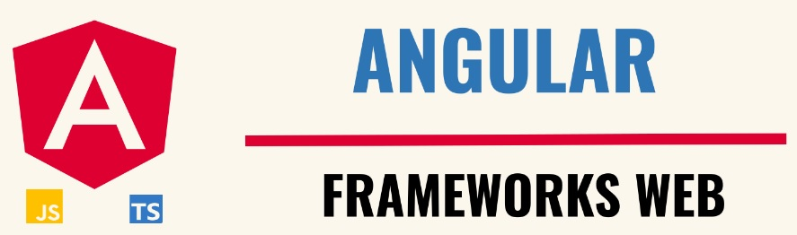

# ☕ Frameworks Web


## Este material foi desenvolvido em resposta a disciplina 'Android para Dispositivos Móveis', a qual faz parte do curso de Pós Graduação em Tecnologia Java, ministrado pela Universidade Tecnológica Federal do Paraná.
🎉 Os projetos (contidos nos diretórios), são entregas, dependêntes entre si, ou seja, o projeto final é composto pela soma de todas as entregas, cada uma em sua devida fase de projeto. Sendo Assim, a entrega de maior valor, exemplo: entrega3, é composta por todas as entregas inferiores + ela. Todas foram solicitadas ao longo do curso e juntas perfazem a nota que compõem a média final.

🥋 Se você está entrando no Java agora, vou deixar um comentário apenas para orientá-lo, caso considere o código destas entregas estranho. Existem todos os níveis de dificuldade, entretanto, as duas últimas foram consideradas pelo professor e os demais colegas, como mais HARD. Aqui, não estamos falando de Java tradicional e sim, Java no eco-sistema Android, até a IDE muda (são tratados assuntos como: banco de dados, gerenciamento de tela, CRUD completo, particularidades do DevAndroid e muito mais...) e sem exageros, caso não entenda de primeira, continue tentando, pois, o sucesso não só reside nos melhores, mas também, nos persistentes, que considero meu caso (_😎tirei nota 9.9 rsrsrs♻️). Desenvolver software, nada mais é que descartar a possibilidade de desistência, independente de qualquer motivo!

## Deve-se utilizar:

   - O Android Studio Dolphin 2021.3.1 ou superior (apenas versões estáveis);
   - Versão do Gradle específica da versão do Android Studio utilizada;
   - Minimum API Level 16 (minSdkVersion 16 no build.gradle (Module: app), que irá alterar a geração do AndroidManifest.xml);
   - targetSDK Version para a API Level 31 (Android 12.0) ou superior.

## 1️⃣ Entrega 01:

### 👨‍💻 Crie o projeto de um aplicativo com Nome relacionado ao Tema Escolhido e Aprovado pelo professor.

- Neste projeto crie uma Activity que implemente um formulário de cadastro de uma das entidades previstas com as seguintes características:

   - Uso de elementos Textview; 
   - Uso de elementos EditText (pelo menos 1);
   - Uso de elementos RadioButton (pelo menos 2) com pelo menos um RadioGroup; 
   - Uso de elementos CheckBox (pelo menos 1);
   - Uso de elementos Spinner (pelo menos 1);
   - Uso de 2 elementos Button;
   - Um dos Buttons deve ter o rótulo "Limpar" e ao ser clicado limpará os valores dos elementos EditText e desmarcará os RadioButtons e CheckBox, e depois será mostrado um Toast indicando a ação realizada;
   - Um dos Buttons deve ter o rótulo "Salvar" e ao ser clicado irá pegar os valores dos elementos EditText, CheckBox, Spinner e o RadioButton selecionado, e validar estes valores. Caso algum EditText esteja vazio ou nenhum RadioButton selecionado, deverá ser mostrado uma mensagem de erro em um Toast e o foco de edição voltará para o campo vazio (caso seja possível).
   - Caso o formulário de cadastro fique maior do que a tela do dispositivo será necessário colocar barra de rolagem, para tal, utilize a classe ScrollView ou HorizontalScrollView.

## 2️⃣ Entrega 02:

### 👨‍💻 Faça uma nova versão do projeto submetido na Entrega 1 criando uma nova Activity que listará itens, estes serão objetos de um tipo de Entidade relacionada ao Tema do Projeto. 

- Neste projeto além do entregue na versão anterior, deve-se:

   - Uso de elementos Textview;
   - Criar uma classe de Entidade relacionada ao Tema do Projeto (Pelo menos 4 atributos);
   - Carregar de Arrays do Resource um conjunto de dados (pelos menos 4 tipos de informação) que possibilite a instanciação de objetos da Entidade (Pelo menos 10);
   - Armazenar as Entidades instanciadas em um ArrayList;
   - Criar uma Activity que exiba um componente de listagem de itens ocupando toda tela, pode ser uma ListView ou RecyclerView (para a disciplina recomendo ListView);
   - Criar um Adapter customizado para exibir os dados de cada Entidade na listagem de Itens;
   - Ao clicar em um item deve-se mostrar uma mensagem em um Toast indicando que o mesmo foi clicado. A mensagem deve conter informações que identifiquem o elemento;
   - A Activity criada de listagem deve ser a principal do Aplicativo (Launcher), para tal no AndroidManifest.xml ela terá mapeada a ação de MAIN e a categoria LAUNCHER. Dica: ao criar uma nova Activity em um projeto já existente marque o item Launcher na tela Assistente de criação (Wizard).
   - Neste Projeto a Activity criada na Entrega 1 permanecerá no projeto, porém não será utilizada pelo usuário.
 
## 3️⃣ Entrega 03:

### 👨‍💻 Faça uma nova versão do projeto submetido na Entrega 2 criando uma nova Activity que exibirá os dados de autoria do App, e também efetivará a transição entre as Activities feitas anteriormente. 

- Neste projeto além do entregue na versão anterior, deve-se:

   - Crie uma Activity que exibirá os dados de Autoria do App, são eles: Nome do aluno, curso e e-mail, breve descrição do que faz o aplicativo, logo e nome da UTFPR;
   - Altere a Activity de Listagem de dados (Feito na Entrega 2), que agora não irá carregar dados de Arrays do Resource, e sim exibir dados cadastrados pela Activity de Cadastro. Para tal coloque no layout:
   - Button com rótulo Adicionar, que ao ser clicado abrirá a Activity de cadastro esperando um resultado (startActivityForResult);
   - Button com rótulo Sobre, que ao ser clicado abrirá a Activity de Autoria do App (startActivity). 
Na Activity de Cadastro (Feito na Entrega 1):
   - Ao clicar no Button "Salvar" deverá ser recuperado os dados da interface, validados e devolvidos a Activity de Listagem com o método setResult e resultado RESULT_OK;
   - Ao executar a ação de Voltar do sistema Android devolva RESULT_CANCELED, para tal inclua o setResult dentro do método que sobrescreve o onBackPressed().
   - Na Activity de Listagem trate o retorno da Activity de Cadastro dentro do método que sobrescreve o onActivityResult. Neste método receba os valores retornados, crie um objeto da entidade (Feita na Entrega 2), adicione ao ArrayList relacionado ao Adapter customizado, e por fim chame o método notifyDataSetChanged() do Adapter que forçará o redesenho dos itens dentro da ListView ou RecyclerView.

## 4️⃣ Entrega 04:

### 👨‍💻 Faça uma nova versão do projeto submetido na Entrega 3 substituindo os Buttons por MenuItens em Menus de Opções, incluindo um Menu de Ação contextual, além de botões Ups nas Activities secundárias.

- Neste projeto além do entregue na versão anterior, deve-se:
  
- Altere a Activity de Listagem:
   - retirando os Buttons e incluindo um menu de opções com:
      -Um MenuItem com o rótulo "Adicionar", um ícone relacionado a esta ação, e com o parâmetro showAsAction com o valor ifRoom; Ao ser clicado deve-se abrir a Activity de cadastro esperando um resultado (startActivityForResult)
      - Um MenuItem com o rótulo "Sobre", sem ícone, que ao ser clicado abrirá a Activity de Autoria do App (startActivity).
   - incluindo um Menu de Ação Contextual que será aberto quando o usuário manter pressionado um dos itens exibidos (na ListView ou RecyclerView). Este menu deve conter:
      - Um MenuItem com o rótulo "Editar", um ícone relacionado a esta ação, e com o parâmetro showAsAction com o valor ifRoom; Ao ser acionado deve-se abrir a Activity de Cadastro passando os dados do Item selecionado (para que o usuário possa alterá-los) e esperando um resultado dela (startActivityForResult);
      - Um MenuItem com o rótulo "Excluir", um ícone relacionado a esta ação, e com o parâmetro showAsAction com o valor ifRoom; Ao ser clicado deve-se remover o Item do ArrayList e na sequência chamar o método notifyDataSetChanged() do Adapter, que forçará o redesenho dos itens dentro da ListView ou RecyclerView.
   - Modificando o método onActivityResult para que quando se retorne da Activity de Cadastro com sucesso (RESULT_OK) e com os novos valores de um item que sofreu edição, estes possam ser recuperados e atribuídos ao objeto da Entidade correspondente. Não esquecendo de após alterar as Entidades do ArrayList chamar o método notifyDataSetChanged() do Adapter, que forçará o redesenho dos itens dentro da ListView ou RecyclerView.
- Altere a Activity de Cadastro:
   - Permitindo que a mesma seja aberta em modo de edição, onde ela já é aberta com dados de uma Entidade já cadastrada, e o usuário poderá alterar os atributos preenchidos;
   - Retirando os Buttons e incluindo um menu de opções com:
      - Um MenuItem com o rótulo "Salvar, um ícone relacionado a esta ação, e com o parâmetro showAsAction com o valor ifRoom; Ao ser clicado deve-se recuperar os dados da interface, validá-los e devolvê-los para a Activity de Listagem com o método setResult e resultado RESULT_OK;
      - Um MenuItem com o rótulo "Limpar, um ícone relacionado a esta ação, e com o parâmetro showAsAction com o valor ifRoom. Ao ser clicado deve-se limpar os valores cadastrados (EditText, CheckBox e RadioButtons) e mostrar uma mensagem em um Toast indicando a ação realizada.
   - Incluindo um botão Up na barra do App, que quando clicado retorna para a Activity de Listagem cancelando a inclusão ou edição de dados aberta.
- Altere a Activity com informações sobre a Autoria do Aplicativo:
incluindo um botão Up na barra do App, que quando clicado retorna para a Activity de Listagem.

## 5️⃣ Entrega 05:

### 👨‍💻 Faça uma nova versão do projeto submetido na Entrega 4 incluindo a persistência através de SharedPreferences de configurações do aplicativo e a internacionalização para dois idiomas.

- Neste projeto além do entregue na versão anterior, deve-se:

   - Internacionalizar o aplicativo incorporando suporte a dois idiomas, o Inglês geral como padrão e o português do Brasil como opcional.
        - Todos os textos fixos de interface devem ter as duas opções de tradução, sejam os apresentados na Activity ou os mostrados em janelas modais ou em caixas de mensagens (como Toast).
   - Incorporar alguma funcionalidade de configuração/personalização do aplicativo por parte do usuário, sendo que as escolhas feitas por ele serão persistidas no dispositivo através do uso de SharedPreferences.
      - Exemplos: escolher forma de ordenação de itens em uma lista; se campos do cadastro já aparecerão com sugestão de preenchimento; se o aplicativo será apresentado utilizando outro tema ou o modo noturno; mostrar as funcionalidades mais usadas em destaque; e etc.
      - Não serão aceitos trocar a cor de fundo de layout (exemplo passado), ou salvar login e senha de usuário (visto que o aplicativo é para uso sem conexão).
    
## 🔚 Projeto Final:

### 👨‍💻 O projeto a ser entregue aqui contempla o que já foi pedido anteriormente nas Entregas Parciais de 1 a 5, além de incluir a persistência dos dados utilizando o Room e o uso de AlertDialogs para exibir mensagens ao usuário.

- Crie um aplicativo que atenda as seguintes funcionalidades:

   - Especifique o tema que trata a aplicação. Este tema deverá ter sido lançado pelo aluno no questionário "Tema do Projeto", e o mesmo precisa ser aprovado previamente pelo professor.    - Não serão aceitos temas repetidos dentro da turma.
   - Cadastre dados lançados pelo usuário, que tenham relação com a regra de negócio proposta para a aplicação (Nesta versão os dados serão persistidos no SQLite através do uso do Room);
   - Crie pelo menos uma Classe de Entidade a ser manipulada dentro da aplicação;
   - Crie pelo menos uma Activity que permita a manipulação dos dados (Inserção, Alteração e Remoção);
   - Exiba um AlertDialog para confirmar a ação do usuário antes de excluir dados persistidos; 
   - Crie pelo menos uma Activity que liste os itens cadastrados no banco de dados;
   - Utilize pelo menos um Adapter Customizado em uma Activity que liste os itens;
   - Crie uma Activity onde mostra-se as informações sobre o que faz o aplicativo, e os dados da autoria dele;
   - Utilize Menus de Opções, onde as ações aparecem com ícones na barra de ação da Activity;
   - Utilize Menu de Ação Contextual, onde as ações aparecem com ícones na barra de ação da Activity;
   - Utilize botões Up na barra de ações das Activities secundárias, para facilitar a volta do usuário destas para as Activities especificadas como pais destas;
   - Forneça alguma possibilidade de configuração ou personalização do aplicativo, e persista estas informações usando SharedPreferences; 
   - O Aplicativo deve suportar dois idiomas, o inglês como padrão e o português Brasileiro como opcional.

🕵️ Critérios de aceite e avaliação:


🎯 Importante:

   - Nos dias de entrega do Projeto Final, caso seja necessário, o professor poderá conversar com cada aluno para que o mesmo apresente o aplicativo criado, explique o código, e tire dúvidas sobre o desenvolvimento de cada funcionalidade.

   - Caso o aluno não saiba apresentar o projeto, o mesma poderá ser recusado e ter a nota zerada.

   - Caso o projeto não compile o mesmo terá a nota zerada.

   - Caso o projeto entregue seja o projeto de outro (como um exemplo passado pelo professor) que foi alterado para atender os requisitos pedidos, o mesmo terá a nota zerada. O aluno pode utilizar os códigos passados na disciplina porém deve criar um projeto novo, e reescrever e não apenas colar o código que irá aproveitar.

# Tecnologia utilizada:


## Tabela de Conteúdos

- [Instalação](#Instalação)
- [Uso](#Uso)
- [Contribuição](#Contribuição)

## Instalação

1. Clone o repositório ou baixe o arquivo .zip:

```bash
git clone https://github.com/alfecjo/android.git
```
## Uso

1. Execute em sua IDE de preferência. Contudo, o desenvolvimento foi feito no Android Studio! Respeite as orientações de versões, pois arquitetura Android leva muito a sério este assunto, MUITO A SÉRIO (sessão: Deve-se utilizar: acima)!!!

## Contribuição

Contribuições são bem-vindas! Se você encontrar algum problema ou tiver sugestões de melhorias, abra um problema ou envie uma solicitação pull ao repositório.

Ao contribuir para este projeto, siga o estilo de código existente, [convenções de commit](https://www.conventionalcommits.org/en/v1.0.0/), e envie suas alterações em um branch separado.

Muito obrigado!!


## controle-doencas-app

### Este projeto tem como objetivo implementar requisitos impostos pela disciplína Frameworks a título de avaliação. Trata-se de uma aplicação web que possibilita rastrear comunidades afetadas por doenças infectocontagiosas. (ex: cadastro, alteração, deleção, listagem), sendo o diferencial, a facilidade de uso e operação pelo cliente;

### O frontend da aplicação foi desenvolvido com Angular e o backend foi simulado pela implementação de uma API Fake, usando o JSON Server;

### Endereço de Deploy - GitHub Pages
(https://alfecjo.github.io/controle-doencas-app/cadastro)

### Protótipo
(<https://www.figma.com/file/Ic3EmqlxEY73UzVz18HHWG/controleDoencas?type=design&node-id=7%3A14&t=CIo2pmdvdcptwzRV-1>)

### Vídeo de Apresentação do Projeto
(<https://youtu.be/45DLJ_OVJCg>)

### Checklist

- [x]Criar o repositório no GitHub com a estrutura do Gitflow, ou seja, branches main e develop.
- [x]Usar componentes de algum framework CSS (Bootstrap, Materialize ou outro)
- [x]Apresentar as telas com layout responsivo usando ou não algum framework CSS.
- [x]Construir páginas web com o conceito de componentes.
- [x]Criar o layout da aplicação com componentes, ou seja, o cabeçalho e rodapé precisam ser componentes.
- [x]Usar pelo menos dois tipos de data-binding (Interpolation, Property Binding, Event Binding e Two Way Data Binding).
- [x]Passar dados via hierarquia de componentes, ou seja, usando @Input ou @Output.
- [x]Mapear componentes à rotas no módulo de rotas.
- [x]Criar navegação entre páginas por meio de rotas.
- [x]Passar dados entre componentes que representam diferentes telas via parâmetros de rotas.
- [x]Validar campos do formulário com REGEX e apresentar os erros.
- [x]Desabilitar o botão de submit enquanto o formulário está inválido.
- [x]Fazer requisições a API com tratamento da resposta com Promises ou Observables.
- [x]Cadastrar uma entidade no JSON Server.
- [x]Apresentar uma lista de dados com a diretiva estrutural ngFor.
- [x]Usar a diretiva ngIf
- [x]Formatar a apresentação de dados com Pipes.
- [x]Build e deploy da aplicação.

### Manual de execução

- Clonar o repositório com git clone;
- Fazer checkout no branch develop que contém as modificações mais recentes;
- Abrir o projeto no editor Visual Studio Code (VS Code);
- Através do terminal cmd-VSCode ou do seu Sistema Operacional apontando para o diretório raiz do projeto;
- Instalar as dependências contidas no package.json
  Comando: npm i;
- (Opcional) Instalar o JSON Server globalmente disponível em https://www.npmjs.com/package/json-server
  Comando: npm i -g json-server
  É opcional porque a dependência já vêm cadastrada no arquivo package.json;
- Executar a API Fake (JSON Server) com o seguinte comando:
  Via Execução explícita: json-server --watch db.json
  O comando para execução do JSON Server deve ser aplicado no diretório /dados, ou seja, que contém o arquivo db.json
  Por padrão, a aplicação JSON Server executa no endereço localhost:3000;
- Abrir um novo terminal cmd-VSCode e então executar o projeto Angular
  Comando: ng s -o;
